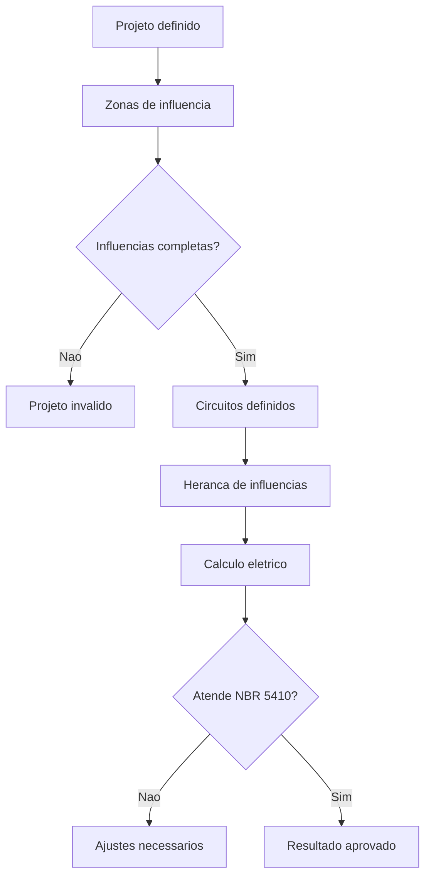

# Arquitetura do PROJEL

Este documento descreve a arquitetura do PROJEL, suas camadas,
responsabilidades e contratos. O objetivo é garantir clareza técnica,
evitar acoplamento indevido e preservar o raciocínio de engenharia
embutido no sistema.

O PROJEL não é uma calculadora elétrica.
É um sistema de apoio ao projeto elétrico conforme a NBR 5410,
orientado por contexto, decisões explícitas e rastreabilidade normativa.

---

## 1. Visão geral da arquitetura

O PROJEL adota uma arquitetura em camadas bem definidas, onde cada parte
possui responsabilidades claras e limites explícitos.

### Princípio central

> O domínio decide o que é engenharia.  
> As demais camadas apenas conversam com ele.

---

## 2. Diagrama de camadas e responsabilidades

```mermaid
graph TD

UI[Frontend / UX]
API[Backend / FastAPI]
DOMAIN[Domain Core]
DB[(Persistencia)]

UI --> API
API --> DOMAIN
API --> DB

DOMAIN -.-> UI
DOMAIN -.-> API
DB -.-> DOMAIN
````

### Interpretação

* O **Frontend** coleta decisões humanas e apresenta resultados.
* O **Backend** orquestra chamadas e valida contratos.
* O **Domain Core** contém toda a lógica de engenharia e norma.
* A **Persistência** apenas armazena dados, sem inteligência.

Dependências pontilhadas indicam **dependências proibidas**.

---

## 3. Domain Core

O `domain_core` é independente de:

* web
* banco de dados
* interface gráfica

Ele pode ser reutilizado em:

* API
* CLI
* aplicação desktop
* integração futura com CAD/BIM

### Submódulos

* `enums`: vocabulário normativo fechado
* `schemas`: estruturas e validações de dados
* `rules`: regras de decisão e herança
* `calculations`: cálculos elétricos normativos

---

## 4. Diagrama de contratos entre camadas

Os contratos definem exatamente o que cada camada pode enviar ou receber.

```mermaid
graph LR

UI -->|Input humano estruturado| API
API -->|Schemas validados| DOMAIN
DOMAIN -->|ResultadoDimensionamento| API
API -->|Resultado formatado| UI
```

### Regras fundamentais

* A UI nunca envia dados soltos.
* A API nunca interpreta norma.
* O domínio nunca formata resposta para humanos.

---

## 5. Fluxo normativo de decisão

O PROJEL não executa cálculo sem contexto válido.



Esse fluxo reflete o raciocínio real de projeto elétrico,
não uma sequência mecânica de fórmulas.

---

## 6. Considerações finais

Esta arquitetura foi projetada para:

* evitar lógica duplicada
* garantir rastreabilidade normativa
* preservar o raciocínio de engenharia
* facilitar ensino e manutenção

Qualquer modificação no sistema deve respeitar
as responsabilidades aqui descritas.

````